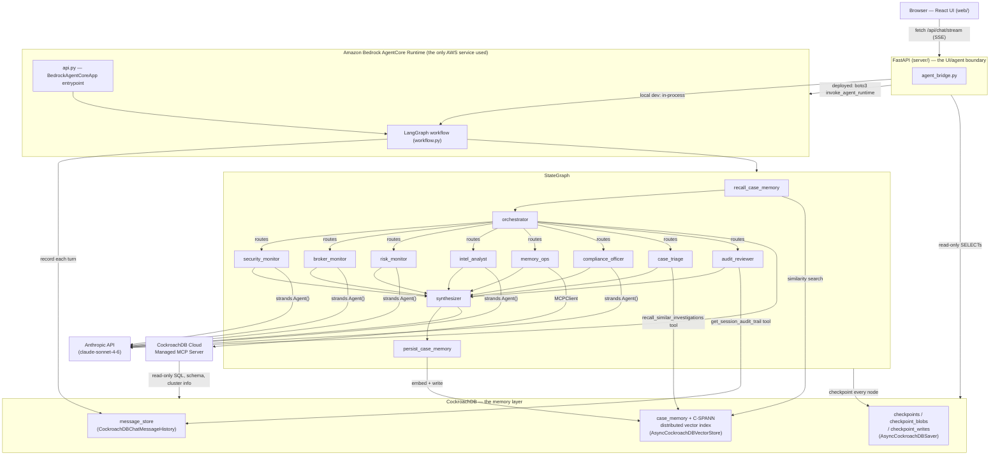

# MemoryMesh Agent

**A market-surveillance multi-agent system whose memory never goes down —
because it isn't in-process, it's CockroachDB.**

Built for the [🪳 CockroachDB × AWS Hackathon](https://cockroachdb-ai.devpost.com/).
LangGraph orchestrates a team of [Strands Agents](https://github.com/strands-agents/sdk-python)
(reasoning via Anthropic's API directly), and every layer of memory —
short-term conversation state, durable audit history, and long-term semantic
case memory — is backed by [CockroachDB](https://www.cockroachlabs.com/), the
one system of record in the whole stack. The only AWS service in play is
[Amazon Bedrock AgentCore](https://aws.amazon.com/bedrock/agentcore/), used
purely to host the runtime.

The market-surveillance domain (agent personas, mock data, report schemas)
is forked from AWS's own public sample,
["Market Surveillance Agent with LangGraph and Strands on AgentCore"](https://aws.amazon.com/blogs/machine-learning/market-surveillance-agent-with-langgraph-and-strands-on-agentcore/).
Everything about *memory* and *model inference* is new.

## Why this is more than "add a database"

Most multi-agent demos treat memory as a chat-history footnote. Here, memory
drives behavior:

1. **Every query starts with a recall step.** Before the orchestrator even
   sees a question, `recall_case_memory` runs a semantic similarity search
   over *every* investigation the system has ever completed — not just this
   session — using CockroachDB's native `VECTOR` type and distributed
   **C-SPANN index**. "Have we seen this pattern before?" is answered from
   real, growing history, across every user and every thread.
2. **Every finished investigation writes itself back into memory.**
   `persist_case_memory` embeds the synthesizer's finding and stores it, so
   the system's memory compounds with use instead of resetting per session.
3. **The agent can inspect its own memory — two different ways.**
   `memory_ops` is wired to the **CockroachDB Cloud Managed MCP Server** and
   answers "how many cases do we have on file for this broker?" by actually
   querying the cluster, read-only. `case_triage` takes a different path
   into the *same* vector index — it calls `recall_similar_investigations`
   itself, mid-reasoning, to decide how urgent the current investigation is
   based on how similar past ones were resolved. One agent reads the
   cluster; the other reads the case history it's built from — memory isn't
   a single bolted-on step, it's a resource multiple agents reach for.
4. **State survives the process.** LangGraph's checkpointer
   (`AsyncCockroachDBSaver`) snapshots the entire workflow state into
   CockroachDB after every node — a crashed container, a scaled-out
   AgentCore replica, or a restart mid-investigation all resume exactly
   where they left off.
5. **Every turn is auditable.** A separate, human-readable
   `message_store` table (`CockroachDBChatMessageHistory`) logs each
   completed turn — the kind of immutable record a real market-surveillance
   workflow needs for compliance, independent of LangGraph's internal
   checkpoint format.

## Architecture



### The web UI: Chat + Dashboard

`web/` is a two-view app behind a left nav rail — **Chat** for the streaming
multi-agent conversation, **Dashboard** for an operational view of the same
CockroachDB tables. Five features exist specifically to make memory
*visible* rather than a number on a stat tile:

- **Vector Memory Map** (`web/src/components/MemoryMap.tsx`, `server/vector_map_routes.py`,
  `server/pca.py`) — every `case_memory` embedding, pulled straight off the
  384-dim `VECTOR` column and projected to 2D with a small server-side PCA
  (pure numpy, no ML framework), rendered as a point cloud. Type a pattern
  into the search box and it calls the *same* `recall_similar_cases`
  function `recall_case_memory`/`case_triage` use internally, plots your
  query on the identical cached basis so it lands next to its real nearest
  neighbors, and lists the ranked matches. This is the distributed vector
  index as something you can look at and query directly, not an
  implementation detail.
- **Checkpoint time-travel viewer** (`web/src/components/TimeTravel.tsx`,
  `server/checkpoint_routes.py`) — the **History** button in the Chat header
  opens a scrubber over the current session's actual `AsyncCockroachDBSaver`
  checkpoint history: every node transition, in order, with the state
  snapshot at that exact step. LangGraph checkpointing already makes this
  possible; nothing else in the UI made it visible before.
- **Live agent pipeline** (`web/src/components/AgentTrace.tsx`) — each
  assistant message now shows a compact node graph (colored, pulsing while
  active) of exactly which agents ran and how many tool calls each made,
  built live from the same SSE event stream, instead of a flat trace list.
- **Explainable triage citations** — when `case_triage`'s
  `recall_similar_investigations` tool returns matches, the UI parses that
  tool result into clickable citation chips (case + similarity score)
  directly under the pipeline, so "why this priority" is inspectable rather
  than buried in prose.
- **Fixed agent→color identity** (`agentColor()` in `web/src/types.ts`) —
  every chart and the pipeline graph color an agent from the same
  fixed-order slot, never by its rank in a sorted list (a real bug in an
  earlier version of the agent-activity bar chart: colors were assigned by
  count-sorted position, so an agent's color would silently change as
  rankings shifted between polls — exactly the failure mode the dataviz
  method's "color follows the entity, never its rank" rule exists to catch).

The two dashboard charts (agent-activity bars, cases-per-day) are hand-rolled
(no charting library) against a categorical palette run through the dataviz
skill's validator for this app's dark surface (`#0a0c10`) — fixed hue order,
direct value labels (never color alone, since one adjacent pair sits in the
CVD warn band), hover tooltips, hairline gridlines. Every dashboard endpoint
(`server/memory_routes.py`, `server/vector_map_routes.py`,
`server/checkpoint_routes.py`) is a read-only query against the same tables
the agents write to — this is a window into real state, not a mock.

### Why a FastAPI layer sits between the UI and the agents

The browser can't call AgentCore's `invoke_agent_runtime` directly — that API
needs a SigV4-signed request with AWS credentials, and those must never ship
to client-side JS. `server/` (FastAPI) exists to:

1. Hold AWS credentials server-side and proxy chat requests to AgentCore.
2. Give the UI one stable streaming contract (`POST /api/chat/stream`, SSE)
   regardless of which backend mode is active — see `server/agent_bridge.py`.
3. **Also run the LangGraph workflow in-process** when no AgentCore runtime
   is configured yet (`AGENT_BACKEND_MODE=local`, the default). Same API,
   same UI, zero AWS — this is what `make dev` uses.
4. Expose read-only CockroachDB endpoints (`/api/memory/*`) so the UI's
   memory panel is a live view of the actual tables the agents write to, not
   a mock.

Compare with the reference architecture this project follows —
["Market Surveillance Agent with LangGraph and Strands on AgentCore"](https://aws.amazon.com/blogs/machine-learning/market-surveillance-agent-with-langgraph-and-strands-on-agentcore/) —
except the memory layer (previously AgentCore Memory) is now CockroachDB,
and the model layer (previously Bedrock-hosted Claude) is now Anthropic's
API called directly from Strands.

### Specialist agents

| Agent | Focus | Tools |
|---|---|---|
| `security_monitor` | Single security, single day | mock report catalog |
| `broker_monitor` | Single security, multiple days | mock report catalog |
| `risk_monitor` | Broker activity, single day | mock report catalog |
| `intel_analyst` | External market research | `http_request` |
| `memory_ops` | **The system's own memory** — case counts, schema, cluster health | CockroachDB Cloud MCP Server (read-only) |
| `compliance_officer` | Checks findings against explicit regulatory thresholds, issues CLEAR/FLAGGED verdicts | mock report catalog + `get_regulatory_thresholds` |
| `case_triage` | Assigns investigation priority by **explicitly querying case memory itself** — a second, agent-driven way of using the vector index, distinct from the automatic recall step | `recall_similar_investigations` → `AsyncCockroachDBVectorStore` |
| `audit_reviewer` | Summarizes the durable audit trail for a session, from CockroachDB — not from its own recollection | `get_session_audit_trail` → `CockroachDBChatMessageHistory` |

`compliance_officer`, `case_triage`, and `audit_reviewer` are the newest
additions, and each one exists to put a *different* CockroachDB memory
component directly in an agent's hands as a callable tool — not just
something the graph does automatically before/after the LLM ever runs.

## CockroachDB tools used

The hackathon requires at least two of the four listed tools. This project
uses **three**:

| Tool | Where | What the agent actually does with it |
|---|---|---|
| **Distributed Vector Indexing** | `src/memory/case_memory.py` | Every investigation is embedded (local ONNX model, no external API) and written to a `VECTOR` column; a **C-SPANN** index (`CSPANNIndex`) keeps cosine-similarity recall fast as case history grows. `recall_case_memory` queries it on *every* incoming request before routing; `persist_case_memory` writes to it after every synthesis. |
| **CockroachDB Cloud Managed MCP Server** | `src/memory/mcp_memory_tools.py`, `src/agents/memory_ops_agent.py` | The `memory_ops` Strands agent is given an `MCPClient` bound to `https://cockroachlabs.cloud/mcp` (service-account bearer token). It calls read-only MCP tools (`list_tables`, `get_table_schema`, `select_query`, `show_running_queries`, …) to answer questions about the memory cluster itself — safe-by-default, fully audited, no custom SQL proxy. |
| **ccloud CLI (agent-ready)** | `scripts/provision_cluster.sh` | Provisions the CockroachDB Cloud cluster and SQL user end-to-end from the terminal with JSON output at every step (`ccloud cluster create`, `ccloud cluster sql-user create`, `ccloud cluster sql --connection-params`) — the same automation-friendly CLI an agent could drive itself. |

Two more CockroachDB integrations round out the memory layer (not on the
four-tool checklist, but core to "Agentic Memory Design"):
**LangGraph checkpointer** (`AsyncCockroachDBSaver`) for workflow state, and
**chat message history** (`CockroachDBChatMessageHistory`) for a durable,
queryable audit log.

We also point contributors at the
[CockroachDB Agent Skills Repo](https://github.com/cockroachlabs/cockroachdb-skills)
(`npx skills add cockroachlabs/cockroachdb-skills`) for anyone doing
schema/ops work on this project with Claude Code, Cursor, or another
MCP-compatible client — see [CONTRIBUTING](#contributing-cockroachdb-skills) below.

## AWS services used

**Amazon Bedrock AgentCore** — and only that. `api.py` wraps the LangGraph
workflow in a `BedrockAgentCoreApp` entrypoint; `deployment/` builds the
container, pushes it to ECR, and provisions an AgentCore Runtime + endpoint.
No other AWS service is used — model inference goes straight to Anthropic's
API, and there is deliberately no `bedrock:InvokeModel` permission in
[`deployment/permissions-policy.json`](deployment/permissions-policy.json).

## Project layout

```
memorymesh-agents/
├── api.py                    # AgentCore entrypoint (BedrockAgentCoreApp)
├── app.py                    # Streamlit UI (legacy — quick ops view)
├── server/                    # FastAPI: the UI/agent boundary
│   ├── main.py                    # app wiring, CORS, serves web/dist in prod
│   ├── auth.py                     # shared-password judge access gate
│   ├── agent_bridge.py            # local-workflow / AgentCore-proxy, one event stream
│   ├── chat_routes.py             # POST /api/chat/stream (SSE)
│   ├── memory_routes.py           # GET /api/memory/* — live reads against CockroachDB
│   ├── vector_map_routes.py       # embedding-map + semantic search (the vector memory map)
│   ├── pca.py                     # numpy PCA + cached basis for the memory map
│   ├── checkpoint_routes.py       # time-travel over a session's LangGraph checkpoints
│   └── config.py                  # backend-mode auto-detection
├── web/                        # Modern UI: React + Vite + TypeScript + Tailwind
│   └── src/
│       ├── App.tsx                 # nav rail + Chat/Dashboard view switch + auth gate
│       ├── lib/useChat.ts          # turns the raw multi-agent event stream into
│       │                           # a clean answer + a separate agent/tool trace
│       ├── components/             # ChatPanel, MessageBubble, AgentTrace, MemorySidebar, Login, …
│       │   ├── Dashboard.tsx           # stat tiles, charts, memory map, cases table, health
│       │   ├── MemoryMap.tsx           # vector memory map + semantic search
│       │   ├── TimeTravel.tsx          # checkpoint scrubber (History button in Chat)
│       │   └── charts/                 # hand-rolled BarChart, TimeSeriesChart, Sparkline
├── src/
│   ├── memory/                # <-- the graded core
│   │   ├── db.py                  # shared CockroachDBEngine connection pool
│   │   ├── checkpointer.py        # AsyncCockroachDBSaver (LangGraph state)
│   │   ├── chat_history.py        # CockroachDBChatMessageHistory (audit log)
│   │   ├── case_memory.py         # AsyncCockroachDBVectorStore + C-SPANN index
│   │   ├── embeddings.py          # local ONNX embeddings (fastembed)
│   │   └── mcp_memory_tools.py    # CockroachDB Cloud MCP client for Strands
│   ├── agents/                 # Strands agents + LangGraph workflow
│   │   ├── model_provider.py      # Anthropic API model factory
│   │   ├── memory_ops_agent.py    # the MCP-powered "introspect my own memory" agent
│   │   └── workflow.py            # StateGraph wiring it all together
│   ├── prompts/, tools/, data_catalog/, utils/  # reused market-surveillance domain
│   └── config/
├── scripts/
│   ├── provision_cluster.sh   # ccloud CLI cluster + user provisioning
│   ├── init_memory_schema.py  # create/migrate all CockroachDB memory tables
│   ├── seed_case_memory.py    # seed a few past cases for an instant demo
│   └── chat_cli.py            # local chat loop, no AWS required
└── deployment/                 # AgentCore IAM/ECR/runtime scripts (local Docker or AWS CodeBuild)
```

## Setup

For a longer walkthrough, see the dedicated
[Setup Guide](docs/SETUP_GUIDE.md) (every `.env` variable explained,
troubleshooting table) and [User Guide](docs/USER_GUIDE.md) (how to use the
Chat and Dashboard views once it's running). The quick version:

### 1. Prerequisites

- Python 3.11+ and Node.js 18+ (for the web UI)
- An [Anthropic API key](https://console.anthropic.com/)
- A CockroachDB cluster — [CockroachDB Cloud](https://cockroachlabs.cloud/) (free tier is fine) or local `cockroach demo`
- For deployment only: AWS CLI v2 with credentials, Docker Desktop (ARM64 build) — or skip local Docker entirely with `make deploy-codebuild` (see below)

### 2. Install

```bash
git clone https://github.com/akashtalole/MemoryMesh-Agents.git
cd MemoryMesh-Agents
python -m venv .venv && source .venv/bin/activate
pip install -r requirements.txt
cp .env.example .env
```

Edit `.env`: set `ANTHROPIC_API_KEY` and `COCKROACHDB_URL` at minimum.

### 3. Provision CockroachDB (optional — skip if you already have a cluster)

```bash
make provision-cluster   # ccloud CLI: creates a cluster + SQL user, prints a connection string
```

Paste the resulting connection string into `COCKROACHDB_URL` in `.env`.

### 4. Initialize the memory schema

```bash
make init-memory   # checkpoints, message_store, case_memory + C-SPANN index — all idempotent
make seed-memory   # optional: seed 3 past cases so recall has something to find immediately
```

### 5. Run the web UI locally (no AWS required)

```bash
make dev
```

Opens the FastAPI backend on `:8000` and the Vite dev server on `:5173`
together (Ctrl-C stops both) — visit **http://localhost:5173**. With no
`AGENTCORE_RUNTIME_ARN` set, the backend runs the LangGraph workflow
in-process, so this is a full end-to-end demo with zero AWS involved. Ask
the same question twice in different sessions and watch the memory sidebar's
case count tick up, then ask a similar question and see the agent's routing
context include the recalled prior case.

Prefer a terminal? `python scripts/chat_cli.py` runs the same workflow
without any HTTP layer.

### 6. Deploy to AWS Bedrock AgentCore

```bash
make deploy
```

This creates the IAM role, ECR repo, builds/pushes the container, and
provisions the AgentCore runtime. **Set `ANTHROPIC_API_KEY` and
`COCKROACHDB_URL` as environment variables on the AgentCore runtime** (via
the AgentCore console or `update_agent_runtime` — they are intentionally not
baked into the image).

No local Docker? `make deploy-codebuild` does the same thing but builds the
ARM64 image on AWS CodeBuild's native ARM64 compute instead of emulating it
locally — see [Setup Guide §8](docs/SETUP_GUIDE.md#8-deploy-to-aws-bedrock-agentcore)
for details.

Deploying somewhere publicly reachable? Set `JUDGE_ACCESS_PASSWORD` first to
gate the app behind a single shared password — see
[Setup Guide, Restricting access before deploying publicly](docs/SETUP_GUIDE.md#restricting-access-before-deploying-publicly).

`deploy-runtime.py` writes the resulting runtime ARN into
`config/dynamic-config.yaml`, which `server/config.py` reads automatically —
the same `make dev` / `uvicorn server.main:app` command now proxies chat
requests to the deployed AgentCore runtime instead of running locally, no
code changes needed. For a single-process production-style run:

```bash
make web-build   # builds web/dist
uvicorn server.main:app --host 0.0.0.0 --port 8000   # serves API + built UI together
```

The legacy Streamlit view (`make start-client`, `:8501`) still works as a
quick ops look at the same AgentCore runtime.

## Sample queries

```text
# Ordinary investigation (writes a new case into memory)
What was the trading activity for AAPL on March 15, 2024 and which brokers were most active?

# Ask a near-duplicate later — watch the orchestrator's context include recalled prior findings
Which brokers were most active trading AAPL in mid-March 2024?

# Memory introspection — routes to memory_ops, which queries CockroachDB via MCP
How many past investigations do we have stored, and have we looked at broker
risk on MSFT before?

# Multi-agent
Analyze MSFT's price movement and broker risk scores between March 10-15, 2024,
and check for any related market news.

# Compliance + triage — routes to compliance_officer and case_triage, the
# latter explicitly querying case memory (not just the automatic recall step)
Is ALPHA_CAPITAL's AAPL trading on March 15, 2024 a compliance issue, and how
urgent is it?

# Audit — routes to audit_reviewer, which reads message_store directly
Give me an audit summary of everything asked and answered in this session.
```

## Judging-criteria notes

- **Agentic Memory Design** — CockroachDB is the *only* memory system: no
  Redis, no separate vector DB, no AgentCore Memory. Checkpoints, audit
  history, and semantic case memory are three distinct CockroachDB-backed
  stores, each earning its keep.
- **Technical Implementation** — parameterised queries throughout (the
  reused `run_report` tool never lets an LLM write raw SQL), MCP access is
  read-only and scoped by service-account key, and TTL is available on
  checkpoints via `CHECKPOINT_TTL_DAYS`.
- **Real-World Impact** — market surveillance is a compliance-critical,
  audit-heavy domain; "has this pattern happened before, across every past
  investigation" and "give me an immutable record of every turn" are real
  requirements, not demo flourishes.
- **Production Readiness** — least-privilege IAM (no Bedrock model
  permissions at all, since this project never calls Bedrock for inference),
  graceful degradation when `COCKROACHDB_MCP_API_KEY` is unset, and a
  connection pool (not a connection-per-request) backing the vector store.
- **Creativity & Originality** — the `memory_ops` agent turning "introspect
  your own memory cluster" into an actual tool call, and case memory
  informing *routing* (not just chat continuity), are the two ideas this
  project leans on hardest.

## Contributing: CockroachDB Skills

If you're working on this project's schema or CockroachDB operations with
Claude Code, Cursor, or another MCP-compatible client, pull in the
[CockroachDB Agent Skills](https://github.com/cockroachlabs/cockroachdb-skills):

```bash
npx skills add cockroachlabs/cockroachdb-skills
```

## License

MIT — see the [LICENSE](LICENSE) file.
